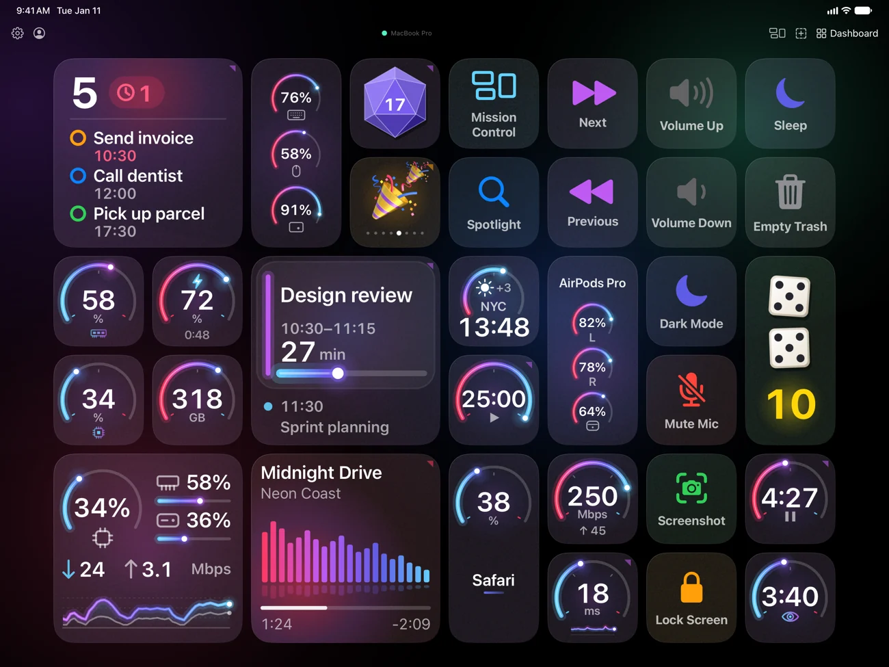
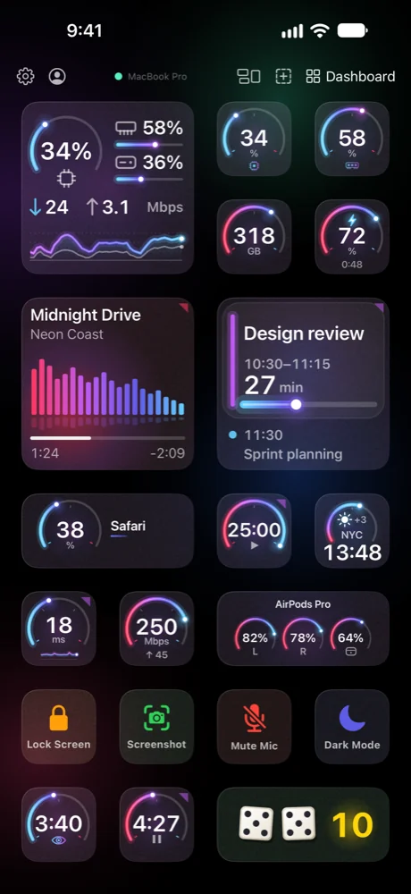
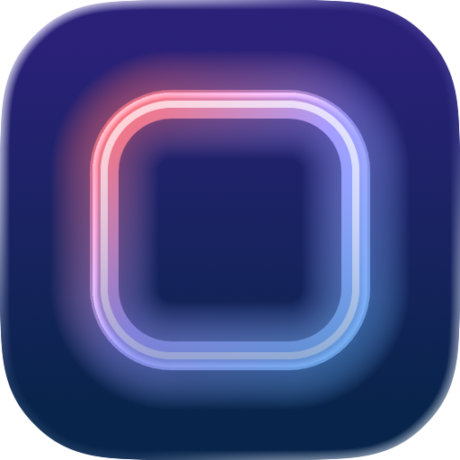

# Desktap Website — Design Reference

This document describes the current design system and implementation of desktap.app, intended as a reference for design tools (Claude Design, Figma, etc.).

---

## Overview

Single-page dark-theme landing site for Desktap — a native iOS/macOS app that turns iPhone/iPad into a programmable command center for Mac. The design language mirrors the app's glass UI aesthetic on a pure black canvas.

**Live preview:** `python3 -m http.server 8000` → http://localhost:8000

---

## Typography

All fonts are Apple system fonts — zero external font loading:

| Role | Font Stack | Weight | Tracking | Usage |
|------|-----------|--------|----------|-------|
| Display headings | `-apple-system, BlinkMacSystemFont, 'SF Pro Display'` | 700 (Bold) | -0.035em to -0.04em | Hero title, section headings, CTA |
| Body text | `-apple-system, BlinkMacSystemFont, 'SF Pro Text'` | 400–500 | normal | Paragraphs, descriptions, buttons |
| Mono / technical | `'SF Mono', ui-monospace, 'Menlo'` | 400–500 | 0.05–0.12em, uppercase | Labels, badges, terminal, tags, card numbers |

### Heading styles

- **Hero h1:** `clamp(2.8rem, 6vw, 5rem)`, weight 700, line-height 1.06, tracking -0.04em
- **Hero h1 on `/next/` (`.hero-pitch`):** two sentences, what the product is and what sets it apart; the second, in the accent gradient, starts its own line (`<br>`). Smaller than a slogan: `clamp(2rem, 4.6vw, 4.25rem)`, line-height 1.04, tracking -0.04em, `text-wrap: balance`
- **Section h2:** `clamp(2rem, 4vw, 3.2rem)`, weight 700, line-height 1.08, tracking -0.035em
- **Card h3:** 1.0625rem, weight 600, tracking -0.02em
- **Section labels:** SF Mono, 0.625rem, tracking 0.12em, uppercase, accent blue color, preceded by a 20px horizontal line

---

## Color System

### Base palette

| Token | Value | Usage |
|-------|-------|-------|
| `--bg` | `#000000` | Page background (pure black) |
| `--bg-elevated` | `#0A0A10` | Slightly raised surfaces |
| `--bg-card` | `#0E0E16` | Card backgrounds (used at 75% opacity with backdrop-blur) |
| `--border` | `rgba(255, 255, 255, 0.06)` | Default borders |
| `--border-hover` | `rgba(255, 255, 255, 0.12)` | Hover-state borders |
| `--text-primary` | `#F0F0F0` | Headings, primary text |
| `--text-secondary` | `#7A7A82` | Body text, descriptions |
| `--text-tertiary` | `#44444C` | Subtle text, card numbers, comments |
| `--accent` | `#3B82F6` | Electric blue — links, buttons, icons, labels |
| `--accent-glow` | `rgba(59, 130, 246, 0.25)` | Button shadows, radial glows |
| `--accent-subtle` | `rgba(59, 130, 246, 0.07)` | Icon backgrounds, tag highlights |
| `--green` | `#34D399` | Success states, "available" badge, terminal success text |

### Cosmos background blobs (from iOS app)

Four animated color blobs rendered on a full-screen `<canvas>`, matching the app's `BackgroundTheme.cosmos`:

| Blob | Color RGB | Position (base) | Radius | Speed |
|------|-----------|-----------------|--------|-------|
| Purple | `120, 50, 180` | (20%, 15%) | 0.35 | slow |
| Blue | `40, 100, 220` | (80%, 45%) | 0.30 | medium |
| Pink | `200, 50, 100` | (25%, 75%) | 0.32 | medium |
| Teal | `50, 180, 140` | (75%, 20%) | 0.25 | fast |

Each blob is an ellipse with a 4-stop radial gradient (0.3 → 0.15 → 0.04 → 0 opacity), wobbles in size via sine, and rotates slowly. The canvas is `position: fixed` behind all content.

---

## Layout & Structure

### Sections (top to bottom)

1. **Nav** — Fixed top, blurred black backdrop (`rgba(0,0,0,0.6)` + `backdrop-filter: blur(24px)`), 56px height. Logo left, links + CTA button right. Logo uses SF Pro Display 600.

2. **Hero** — Full viewport height, vertically centered. Two-column grid (`.hero-duo`, the right column 1.2× the left): left column has h1 + subtitle + action buttons; right column has the picture. On mobile (≤1024px) collapses to single column, centered.
   The picture is the deck on an iPad (landscape) and an iPhone, `assets/deck-ipad.webp` and `assets/deck-iphone.webp`: renders of the app in Apple's product bezels, transparent around the devices. Apple's rules for showing its devices apply (App Store Marketing Guidelines): whole, upright and unchanged — no shadow, reflection or highlight on them; nothing over them (no floating tags); no motion but a fade (the pair fades in, it doesn't rise like the text; no tilt on hover); at least 200 px on screen. So: side by side and bottom-aligned at their real relative size (the iPhone 76% of the iPad's height), a still accent aura behind. ≤1024px: the pair under the text, up to 760px wide. ≤520px: one under the other — the iPad full width, the iPhone at the same scale and never under 200 px tall. A new render replaces both files at the same size (iPad 1400×1073, iPhone 540×1102) and `assets/og-image.jpg` after them ("Social preview card").

3. **Marquee** — Horizontal auto-scrolling ticker strip. SF Mono uppercase items separated by small blue diamond glyphs. Bordered top and bottom. 30s infinite linear scroll, seamless loop via duplicated items.

4. **Features (Bento Grid)** — Split header (title left, description right). Below: 12-column CSS grid with cards of varying spans:
   - Row 1: 8-col card (command types with tag pills) + 4-col card (AI setup)
   - Row 2: 4-col + 4-col + 4-col (live dashboards with animated bars, auto-switch, native Swift)
   - Row 3: remaining cards at 4-col each

5. **AI** (`#ai`) — what sets Desktap apart: an AI builds whole pages, and each change it sends waits for Accept on the phone. Left: label, H2 with the accent words in serif italic, a lede; then "you say → you get" (a `dl`, each ask in display italic, its result after an accent →, divided by 1px rules; under 560px the result goes under the ask), the promise card with a shield, and "Works with" tags. Right: the review card as the app draws it — `assets/ai-review-iphone.webp`, a render of the app on iPhone in Apple's bezel, at most 340px wide, a still aura behind, a fade without movement (`.reveal-fade`), a mono caption under it; ≤1024px it goes between the lede and the asks, 300px wide (260px under 560px). Under both, a glass strip for Claude Code waiting on you: the recipe's live face (`data-face="claude"`, `assets/js/live-widgets.js`) on a patch of phone screen, two lines and "The recipe →".
   The promises use the agent's own words, as the FAQ does: "Changes an AI sends through Desktap wait for your Accept on your iPhone or iPad" and "Through Desktap, an AI can't press your buttons or delete anything" — never "Nothing changes until you tap Accept" on its own (the card on the phone may say it about its own change). AI apps are named in text, never with their logos. The examples come from the docs (AI › Asking for widgets) and the agent's **AI Assistants** header; the last one is the change on the card.

6. **How It Works** — Centered header. Three-column grid with 1px gap (acts as divider). Large outline step numbers (01, 02, 03 with `-webkit-text-stroke`). Arrow circles between steps.

7. **FAQ** (`/next/` only) — Two columns: label + heading + one line on the left (sticky); on the right a list of `<details>` questions divided by 1px rules, a + that turns into an accent × when open, the first one open. Every answer ends with an accent "Docs: …" link to the page with the details. Stacks ≤1024px.

8. **CTA** — Centered heading + subtitle + two buttons. Subtle radial gradient glow behind (purple → blue → transparent).

   **Trust line** (`.trust-line`, `/next/` hero and CTA, `/changelog/`): under the agent's download button, "Free · v1.2.3 · 7.6 MB · macOS 15+ · Notarized by Apple" in SF Pro Text 0.8125rem, secondary color, `·` separators in tertiary. Version and size come from the latest GitHub release (`assets/agent-download.js`: GitHub API, cached for the browser session, size in decimal MB as Finder shows it); until they arrive, or if GitHub doesn't answer, both stay hidden and the line reads "Free · macOS 15+ · Notarized by Apple". The version links to the entry of its major.minor version in `/changelog/`. "Notarized by Apple" means checked for malware, not reviewed: never "Apple-approved".

   **Changelog** (`/changelog/`, "What's new", linked from the `/next/` footer and from the version in the trust line): Desktap's releases, newest first, written by hand for people, not copied from GitHub. The iPhone & iPad app and the Mac agent come out together with one version number, so one entry covers both; only major and minor versions get an entry (2.0, 2.1…), bug-fix updates (2.0.1…) are not listed. Header: label, H1, lede, the download button with the "Coming soon" note for the app, and the trust line. Then one `li.release` per release, `id` and `data-release-entry` = `v` + major.minor (`v2.0`): on the left the version (display 700, 1.5rem, a link to its own anchor), the date and a green "Latest" pill; on the right a short title, then the changes in two groups, **iPhone & iPad** and **Mac agent** (`h3.release-group`, mono uppercase), each change led by a mono pill: **New** (accent), **Improved**, **Changed** (neutral), **Fixed** (green). `agent-download.js` reads the GitHub releases: the date is that of the first release of the version (until then the entry reads "Coming soon"), "Latest" goes on the version of the newest release, and the trust line's version (`v2.0.3`) links to its entry (`#v2.0`). Stacked under 768px; under 480px the pill sits above its line. Changes say what a person or their AI gets, quoting the app's English labels in bold and MCP tools in code; never how the app is built. A new version: add its entry at the top of the list before or on release day.

9. **Footer** — Minimal. Logo + links left, copyright right. SF Mono-ish for logo.

---

## Cards & Surfaces

- **Background:** `rgba(14, 14, 22, 0.75)` — semi-transparent so cosmos blobs show through
- **Backdrop filter:** `blur(16px)` — glass effect matching iOS `ultraThinMaterial`
- **Border:** 1px `rgba(255, 255, 255, 0.06)`, on hover `rgba(255, 255, 255, 0.12)`
- **Border radius:** 14px for cards, 12px for terminal, 8px for buttons, 4px for tags/badges
- **Hover:** translateY(-2px) + border lightens
- **Mouse-follow glow:** Radial gradient (`600px circle`) at cursor position, blue accent at 7% opacity, revealed on hover via CSS custom properties `--mouse-x` / `--mouse-y` set by JS

---

## Interactive Elements

### Buttons

| Type | Background | Text | Border | Hover |
|------|-----------|------|--------|-------|
| Primary | `#3B82F6` (accent) | white | none | translateY(-1px), blue glow shadow |
| Secondary | transparent | `--text-secondary` | 1px `--border` | text brightens, border lightens, faint white bg |
| Nav CTA | `--text-primary` (white) | black | none | opacity 0.85 |

All buttons: SF Pro Text weight 500, 0.9375rem, padding 14px 28px, border-radius 8px. Primary has a subtle `linear-gradient(135deg, rgba(255,255,255,0.1), transparent)` overlay.

### Tags / Badges

- **Hero badge:** Green dot (pulsing animation) + SF Mono uppercase, green text on green 5% bg, 4px radius
- **Command tags:** SF Mono 0.5625rem, default has faint border; `.active` variant has blue border + blue text + blue 7% bg
- **Compatibility tags:** SF Mono 0.5625rem uppercase, neutral border, secondary text

---

## Animations

| Element | Type | Duration | Easing | Details |
|---------|------|----------|--------|---------|
| Hero elements | Staggered fadeUp | 0.7s each | cubic-bezier(0.16,1,0.3,1) | h1→subtitle→buttons, delays 0.25–0.5s; then the devices fade in (opacity only, 1s, delay 0.6s) |
| Scroll reveals | fadeUp on intersect | 0.8s | cubic-bezier(0.16,1,0.3,1) | IntersectionObserver, threshold 0.08, -60px rootMargin |
| Bento cards | Staggered reveal | +100ms each | same | Children delayed 0–500ms |
| Live bars | Pulsing | 1.5s infinite | ease-in-out | scaleY 1→1.15, opacity 0.4→0.8, staggered delays |
| Live widgets on `/next/` | Button faces, drawn by `face-player.js` | as a script would send them | linear or easeInOut | A page of eight buttons on a patch of phone screen (`.ww-deck`, 4×3, gap a tenth of a column): Now Playing (Large, a gradient per track, level bars, progress), Claude Code needing input, a CI build, BTC price with a scrolling chart (Wide), weather, CPU ring, Pomodoro, GitHub stars. Only SVG the phone draws (shapes, gradients, text; no images or filters); made-up data. They come alive when the section is on screen and stop off screen; with Reduce Motion one still frame. Before the script loads: empty glass buttons. Under the deck, "Browse the widget recipes" links to `/docs?p=recipes-widgets`. |
| Cosmos blobs | Continuous drift | ~20–25s cycle | sine/cosine | Position, size wobble, rotation |
| Green badge dot | Pulse | 2s infinite | ease-in-out | Opacity 1→0.4 |
| Marquee | Linear scroll | 30s infinite | linear | translateX 0→-50% |

---

## Responsive Breakpoints

| Breakpoint | Changes |
|-----------|---------|
| ≤1024px | Hero → single column centered, the devices under the text (up to 760px). AI → single column: header, the review card (up to 300px), then the asks, the promise and Works with. Features header → single column. |
| ≤768px | AI: the Claude Code strip wraps its link under the text. Bento → single column (all spans become 1). Steps → stacked. Nav: section links hidden, Docs and the CTA stay (`.nav-compact` on `/next/`; the other pages hide all nav links). Footer stacked centered. |
| ≤560px | AI: each answer under its ask, the review card up to 260px, the Claude Code strip stacked (button, text, link). |
| ≤520px | Hero devices one under the other: the iPad full width, the iPhone at the same scale, never under 200px tall. |
| ≤480px | Hero h1 → 2rem. Buttons stack vertically. |
| Phone or tablet (any width) | On `/next/` and `/changelog/` the download buttons read "Send to Mac" / "Send link to Mac" and open the share sheet with the `/download/` link (`mailto:` without Web Share). iPhone, iPad and Android: `html.handheld`, set in `<head>` before the first paint; each button carries both labels, `.only-mac` / `.only-handheld`; the click is handled in `assets/agent-download.js`. |

---

## Grain / Texture

A subtle noise overlay covers the entire page via `body::before`:
- SVG-based `feTurbulence` fractal noise
- `opacity: 0.025`
- `position: fixed`, `pointer-events: none`, `z-index: 9999`
- Adds subtle texture to the otherwise smooth dark background

---

## Docs

The documentation is one shell, `docs.html` + `assets/docs/docs.js`, that loads `assets/docs/pages/<slug>.md` for `docs?p=<slug>` and renders it with marked. Same tokens, fonts and black canvas as the landing; the extra tokens are `--warn: #FBBF24` and `--phone-screen: #0D0D0D`.

### Layout

| Width | Columns |
|-------|---------|
| ≥ 1200px | page list (232px) · content (≤ 760px) · "On this page" rail (200px, H2 + H3, sticky) |
| 900–1199px | page list · content; "On this page" is a closed dropdown above the content |
| < 900px | content only, 24px gutter (16px ≤ 640px). A sticky sub-bar under the site nav, "☰ Pages · <page title>" with ‹ › for prev/next, opens one slide-in panel from the left: the page list with the current page expanded to its H2s and H3s |

- **Page list:** five groups (Start, Learn, Build, Look up, AI) as mono uppercase labels; the current page has the accent-subtle fill with a 2px accent bar and lists its H2s under it.
- **Page header:** eyebrow = the page's group (mono, accent, 24px rule), the H1, then an "Updated <date>" pill from the page's `<!-- updated: … -->` line.
- **Prev / next:** two cards at the end of every page, in manifest order.
- **Headings:** a `#` link appears on hover for every H2/H3 (hidden on touch).
- Nothing scrolls sideways except code blocks and tables, which fade at the right edge while more is hidden.

### Callouts (GitHub-alert syntax)

| Markdown | Look | Use |
|----------|------|-----|
| `> [!NOTE]` | neutral rule, info icon | context |
| `> [!TIP]` | accent rule and label | an optional better way |
| `> [!WARNING]` | amber rule and label | real risk only |
| `> [!SEE]` | green rule, eye icon, label "What you'll see" | the moment the reader checks success |
| `> [!STEP] 2 · Title` | card with a numbered circle; consecutive steps are joined by a thin accent line | numbered setup steps |

Text on the marker line becomes the title (`> [!TIP] A faster way`). In step cards and see-boxes:
- an image standing on its own line (or at the start or end of a paragraph) moves into a picture column: right of the text in a step card, left of it in a see-box; it stacks under the text ≤ 640px. If any image in the box is wider than 280px (`width` attribute), all stay in the text flow at full width;
- a paragraph starting with "Done when" gets a green check (steps);
- a line starting with "Not seeing it?" becomes the box's small footer line (see-boxes), also when it follows another line of the same paragraph.

### Code blocks

- **Header tab** from the fence's info string: ```` ```zsh title="Startup Script" ````. Known titles get an icon and a hint: Startup Script (Advanced › Startup Script), Shell Command (Tap action), Terminal (On your Mac), SVG Drawing (Icon › SVG Drawing), Body (JSON), AppleScript (Tap action). Without a title the header shows the language (zsh, JSON, SVG, AppleScript); a `text` fence has no header and its Copy floats over the corner.
- **Copy** is always visible in the header and copies the whole block, folded parts included.
- **Helpers block:** the lines from `# ── Desktap helpers (the same in every recipe) ──` to `# ── end of helpers ──` fold into their first line with a "show N lines" pill.
- **Long code:** more than 30 visible lines (not counting a folded helpers block) folds to 20 lines with a fade and "Show all N lines". Flag `open` in the info string turns this off; a block inside `<details>` never folds. Flag `primary` gives the block the accent glow.
- **Highlighting** (no library): comments gray `#7C7C86`, strings mint `#A7D9BC`, variables, numbers and tags light blue `#93C5FD`, keywords bold white, JSON keys `#E4E4E7`, attributes `#A0A0A8`. Languages: zsh/sh/bash, json, svg/xml/html, applescript.
- **Chips:** `{{CELL_ID}}`, `{{DESKTAP_TOKEN}}`, `$DESKTAP_TOKEN` and `$DESKTAP_STORAGE` get a blue underlined chip with a tooltip, in code blocks and in inline code (not in headings).

### Other blocks

- **Tables** sit in a rounded frame and scroll inside it. Wrap one in `<div class="stack-table">` (blank lines around the table) to turn each row into a card ≤ 480px, labelled with the column names.
- **Inline code** up to 24 characters never breaks; longer code wraps anywhere.
- **`<details><summary>…</summary>`** is a bordered box with an accent ▸; use it for the full script of a recipe and for optional depth.
- **Link cards:** `<div class="link-cards">` around a list whose items start with a link ("- [SVG faces](?p=svg-faces) — draw it.") turns them into a grid of clickable cards; the dash after the link is dropped.
- **Recipe cards:** `<div class="recipe-cards" data-set="widgets"></div>` (or `alerts`) is filled from `pages.json` `recipes`: thumbnail on the `--phone-screen` patch, title, summary, tags (size first), and "On <page> →" when the recipe lives on another page. A recipe with no button (a Terminal command) shows its command in a mono pill (`thumbText`) instead of a face. 2 columns from ~640px of content width, 1 below; at 480px or less each card puts its face in a 104px column on the left, so a set of nine stays short. No animation on cards.
- **Images:** `/<name>.png" width=".." height=".." alt="..">`; `docs.js` adds lazy loading and warns in the console when `width`/`height` is missing.
- **App screenshots:** a phone screen is shown 280 px wide (`width="280"`, file at 2×, 560 px; a Mac window 760 px, file 1520 px). In a step card the picture column is capped at 240 px, in a see-box at 220 px. Two screens side by side: `<div class="shot-pair">` around two `` (the second wraps under the first when the column is narrow, so a caption must not say "left" and "right"; use 240 px each). A ring over one spot of a screenshot: `<picture class="shot-ring" style="--x:78.6%;--y:8.5%;--d:9%"></picture>`; `--x` and `--d` are shares of the picture's width, `--y` a share of its height. A `<picture>` (not a wrapper `<span>`) so that a step card still moves it into its picture column.

### Diagrams

`<div class="dt-mount" data-diagram="NAME" data-mode="MODE">One sentence.</div>` shows the sentence in a dashed placeholder (min-height 320px) until `assets/docs/js/diagrams/NAME.js` loads, which happens when the mount comes within 600px of the viewport. The module draws a `figure.dt-diagram` card from `dt-chrome.js`: eyebrow (mono, accent, 20px rule), title (display 600, 1.125rem), one-line lede, mono pill controls, legend, and a caption that states the rule in bold first. It reads `prefers-reduced-motion` itself (no autoplay, a static storyboard) and pauses off screen and in hidden tabs. A module that fails to load leaves the sentence in place.

### Status colors

| Color | Means |
|-------|-------|
| Accent `#3B82F6` | glide, normal, links, tips |
| Amber `#FBBF24` | cross-fade, warning |
| Green `#34D399` | success: see-boxes, "Done when", Copied |
| Phone colors (`#34C759`, `#FF9F0A`, `#FF453A`) | only inside drawn phone content, on `--phone-screen` |

---

## File Structure

```
├── index.html          — Holding page: one screen, "Coming soon" (noindex)
├── next/index.html     — The full landing, reworked here (noindex, absolute paths, nothing links to it)
├── changelog/index.html — "What's new": Desktap's releases (app and agent, 2.0, 2.1…), newest first (noindex like /next/; linked from /next/)
├── privacy.html        — Privacy Policy (legal layout)
├── terms.html          — Terms of Use (legal layout)
├── docs.html           — Docs shell (loads assets/docs/pages/<slug>.md)
└── assets/
    ├── docs/           — docs.js, pages.json, pages/*.md, js/ (diagrams), img/
    ├── agent-download.js — The agent's download buttons: trust line from the latest release, "Send link to Mac" on a phone
    ├── js/live-widgets.js — the live buttons of the Live widgets section on /next/ (imports docs/js/face-player.js)
    ├── style.css       — Complete stylesheet (~3100 lines; docs part at "Docs")
    ├── deck-ipad.webp, deck-iphone.webp — /next/ hero: the deck in Apple's bezels (iPad landscape 1400×1073, iPhone 540×1102)
    ├── ai-review-iphone.webp — /next/ AI: the review card of a change from an AI, on iPhone in Apple's bezel (680×1388)
    ├── icon.png        — App icon (256×256)
    ├── og-image.jpg    — Social preview: docs, privacy, terms, next/, changelog/ — the hero's words and the deck screens (see "Social preview card")
    ├── og-deck-ipad.webp, og-deck-iphone.webp — the deck screens without a bezel, for og-image.jpg (iPad 1300×975, iPhone 460×1000)
    ├── og-soon.jpg     — Social preview of the holding page — icon, name, "Coming soon"
    └── favicon.ico     — Favicon
```

No build tools, no frameworks, no external CSS libraries. Pure HTML + CSS + vanilla JS (~115 lines for canvas animation, scroll observer, mouse tracking).

---

## Social preview card

`assets/og-image.jpg` and `assets/og-soon.jpg` (1200×630) are shots of the page below. It lives here, not as a file: GitHub Pages publishes every file of the repo, and a service page shouldn't open on desktap.app by a direct link.

Two cards in one page. Without a query, the deck card — `og-image.jpg`: the words of the `/next/` hero and the same deck as the hero's, as the iPad and iPhone screens alone (`assets/og-deck-ipad.webp`, `assets/og-deck-iphone.webp`: the renders' screens without a bezel, the status bar hidden by the card), no name in the picture — the preview's title carries it. With `?label=…` — `og-soon.jpg`: the icon, the name and the label. A new render of the deck: replace both webp files at the same size (iPad 1300×975, iPhone 460×1000), then shoot `og-image.jpg` again.

No Apple bezels on the card: a link preview shows it 300–600 px wide, and a device in it would be under the 200 px Apple asks for. The screens are the app's own pictures: rounded corners and a shadow are ours to choose.

The card is changed here, in this template (name, label, words, look). `og-card.html` is only a throwaway copy to shoot from: an edit made in the copy is lost when it is deleted.

1. Copy the template into `og-card.html` in the site root (`.gitignore` keeps it out of commits) and run `python3 -m http.server 8000`.
2. Shoot each variant into its own PNG at 1× — 1200×630, not 2400×1260 as on a Retina screen. Chrome without a window, in a throwaway profile; such a Chrome keeps running after the PNG is written, so `shot` stops it:
   ```
   chrome="/Applications/Google Chrome.app/Contents/MacOS/Google Chrome"
   shot() {
     rm -f "$1"
     "$chrome" --headless=new --user-data-dir="$(mktemp -d)" --force-device-scale-factor=1 --hide-scrollbars \
       --window-size=1200,630 --screenshot="$1" "$2" >/dev/null 2>&1 &
     local pid=$!; for i in {1..40}; do [[ -s $1 ]] && break; sleep 0.5; done; sleep 1; kill $pid
   }
   shot og-image.png "http://localhost:8000/og-card.html"
   shot og-soon.png  "http://localhost:8000/og-card.html?label=Coming%20soon"
   ```
3. Each PNG goes to its own JPEG — the deck card (no query) to `og-image.jpg` (docs, privacy, terms, `next/`, `changelog/`), the name card ("Coming soon") only to `og-soon.jpg` (holding page). `-z 630 1200` keeps them at exactly 1200×630 even if a shot came out at 2×:
   ```
   sips -z 630 1200 -s format jpeg og-image.png --out assets/og-image.jpg
   sips -z 630 1200 -s format jpeg og-soon.png  --out assets/og-soon.jpg
   ```
4. Delete `og-card.html` and both PNGs.

```html
<!DOCTYPE html>
<html lang="en">
<head>
<meta charset="UTF-8">
<meta name="robots" content="noindex">
<style>
  :root{
    --accent:#3B82F6;
    --display:-apple-system,BlinkMacSystemFont,'SF Pro Display','Helvetica Neue',system-ui,sans-serif;
    --mono:'SF Mono',ui-monospace,Menlo,monospace;
  }
  *{margin:0;padding:0;box-sizing:border-box;}
  [hidden]{display:none !important;}
  html,body{width:1200px;height:630px;overflow:hidden;}
  body{background:#000;position:relative;color:#F0F0F0;font-family:var(--display);-webkit-font-smoothing:antialiased;}
  /* One still aura in the accent color */
  .aura{position:absolute;left:50%;top:50%;width:1100px;height:760px;transform:translate(-50%,-50%);
        background:radial-gradient(closest-side,rgba(59,130,246,.13),rgba(59,130,246,0));}

  /* The name card (?label=…) */
  .name-card{position:relative;height:100%;display:flex;flex-direction:column;align-items:center;justify-content:center;}
  .name-card img{position:relative;width:132px;height:132px;border-radius:30px;margin-bottom:40px;box-shadow:0 18px 50px rgba(0,0,0,.6);}
  .name,.label{position:relative;}
  .name{font-size:88px;font-weight:700;letter-spacing:-.04em;line-height:1;}
  .label{margin-top:30px;font-family:var(--mono);font-size:22px;letter-spacing:.24em;text-transform:uppercase;color:#7A7A82;}

  /* The deck card (default): the words as the /next/ hero says them; the hero's deck as the iPad and iPhone screens
     alone — no Apple bezel (see above); the status bar is cut off, so the screens read as the app, not as a device */
  .deck-card{position:relative;height:100%;display:flex;align-items:center;gap:36px;padding:0 56px 0 72px;}
  .deck-card .aura{left:72%;width:900px;height:700px;background:radial-gradient(closest-side,rgba(59,130,246,.18),rgba(59,130,246,0));}
  .pitch{position:relative;flex:1;font-size:50px;font-weight:700;line-height:1.06;letter-spacing:-.04em;
         background:linear-gradient(180deg,#fff 0%,#a8a8b4 100%);-webkit-background-clip:text;background-clip:text;-webkit-text-fill-color:transparent;}
  .pitch .accent{display:block;margin-top:6px;font-style:italic;padding-right:.04em;
         background:linear-gradient(135deg,#bf5af2 0%,#64d2ff 50%,#30d158 100%);-webkit-background-clip:text;background-clip:text;-webkit-text-fill-color:transparent;}
  .screens{position:relative;flex:none;width:640px;height:520px;}
  .screen{position:absolute;overflow:hidden;background:#000;
          box-shadow:0 0 0 1px rgba(255,255,255,.14),0 30px 60px rgba(0,0,0,.6);}
  .screen img{display:block;width:100%;}
  .screen.ipad{left:0;top:20px;width:560px;height:405px;border-radius:22px;}
  .screen.ipad img{margin-top:-14px;}      /* the status bar off */
  .screen.iphone{right:0;bottom:0;width:186px;height:368px;border-radius:30px;}
  .screen.iphone img{margin-top:-25px;}
</style>
</head>
<body>
  <div class="deck-card" id="deck-card">
    <div class="aura"></div>
    <div class="pitch">A control deck for your Mac, on iPhone and iPad. <span class="accent">Your AI builds it.</span></div>
    <div class="screens">
      <div class="screen ipad"></div>
      <div class="screen iphone"></div>
    </div>
  </div>
  <div class="name-card" id="name-card" hidden>
    <div class="aura"></div>
    
    <div class="name">desktap</div>
    <div class="label" id="label"></div>
  </div>
  <script>
    const label = new URLSearchParams(location.search).get('label');
    if (label) {
      document.getElementById('label').textContent = label;
      document.getElementById('name-card').hidden = false;
      document.getElementById('deck-card').hidden = true;
    }
  </script>
</body>
</html>
```

---

## Key Design Decisions

1. **Pure black background (#000)** — matches the iOS app's canvas and makes the Cosmos blobs pop
2. **System fonts only** — SF Pro renders natively on Apple devices (the target audience), zero FOIT/FOUT, instant paint
3. **Semi-transparent cards with backdrop-blur** — cosmos blob light bleeds through, creating the same glass effect as the iOS app's `ultraThinMaterial`
4. **Bento grid (not uniform cards)** — creates visual hierarchy; the 8+4 first row draws attention to the core value prop (8 command types)
5. **The real review card for AI** — a render of the app, not a mockup: it shows what a visitor will approve, with the code, which no chat bubble can
6. **Monospace used sparingly** — only for technical labels, badges, terminal, and tags; all headings and body in system sans for Apple-clean readability
7. **No external dependencies** — entire site loads from 4 files (HTML, CSS, 2 images), under 100KB excluding images
